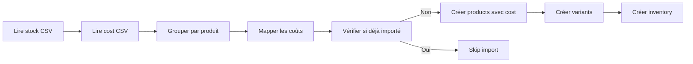

# 📊 Import automatique du stock initial

## 🎯 Fonctionnement

Le script `init_collections.py` gère **automatiquement** l'import du stock initial depuis `stock_initial.csv` au premier démarrage de PocketBase.

## ⚡ Avantages vs API

| Méthode | Vitesse | Fiabilité | Utilisation |
|---------|---------|-----------|-------------|
| **Script interne** | ⚡ **Très rapide** (batch inserts directs) | ✅ Transactionnel | Premier démarrage uniquement |
| API FastAPI | 🐌 Lent (1 requête par ligne) | ⚠️ Risque timeout | Usage ponctuel |

### Pourquoi c'est plus rapide ?

1. **Pas de couche réseau** : Appels directs à l'API PocketBase interne
2. **Groupage intelligent** : Regroupe les variantes par produit (1 produit → N variants)
3. **Pas de double auth** : Une seule authentification admin au démarrage
4. **Évite les doublons** : Vérifie si déjà importé avant de lancer l'import

## 📋 Format du CSV

### Stock initial (`stock_initial.csv`)

```csv
ID,Modèle,Couleur,Sexe,Pointure,Quantité
1,Arabique,Multicolore,Femme,37,1
1,Arabique,Multicolore,Femme,38,2
```

**Colonnes obligatoires :**
- `ID` : Identifiant numérique du modèle (peut être dupliqué pour les variantes)
- `Modèle` : Nom du produit
- `Couleur` : Couleur du produit
- `Sexe` : `Femme`, `Homme` ou `Unisex` (converti en `femme`, `homme`, `mixte`)
- `Pointure` : Taille/pointure
- `Quantité` : Quantité en stock

### Mapping des coûts (`cost_mapping.csv`)

```csv
Modèle,Sexe,Cout,Couleur,Source du prix
Arabique,Femme,75,Multicolore,conversation
Babouche Christine,Femme,90,Multicolore,conversation
```

**Colonnes utilisées :**
- `Modèle` : Nom du produit (doit correspondre au CSV de stock)
- `Couleur` : Couleur (doit correspondre exactement)
- `Sexe` : Genre (Femme/Homme/Unisex)
- `Cout` : Coût d'achat en euros

> 💡 Le script fait automatiquement le matching entre les deux CSV via `(Modèle, Couleur, Sexe)`.

## 🔧 Génération des SKU

Le script génère des SKU uniques au format : `{ID}-{3_LETTRES_COULEUR}`

**Exemples :**
- ID=1, Couleur=Multicolore → SKU=`1-MUL`
- ID=22, Couleur=Blanche → SKU=`22-BLA`
- ID=150, Couleur=Noire → SKU=`150-NOI`

## 🔄 Processus d'import



1. **Lecture du stock CSV** : Parse toutes les lignes de stock
2. **Lecture du cost CSV** : Charge le mapping des coûts
3. **Groupage** : Regroupe par `(ID, Modèle, Couleur, Sexe)`
4. **Mapping des coûts** : Associe le coût via `(Modèle, Couleur, Sexe)`
5. **Vérification** : Check si `products` est vide
6. **Création products** : Insère les produits avec `cost` (et `price=null` pour l'instant)
7. **Création variants** : Pour chaque taille d'un produit
8. **Création inventory** : Associe la quantité à chaque variant

## 🚀 Utilisation

### Démarrage normal

```bash
docker compose up --build
```

Le script s'exécute automatiquement après la création des collections.

### Réinitialiser et réimporter

```bash
# Supprimer les données PocketBase
rm -rf pocketbase/pb_data

# Redémarrer
docker compose up --build
```

## 📊 Statistiques d'import

Après import du CSV fourni :
- **61 modèles Femme** (ID 1-61)
- **53 modèles Homme** (ID 101-153)
- **19 modèles Unisex** (ID 201-219)
- **Total : 133 produits uniques**
- **757 variants** (combinaisons produit+taille)

## ⚠️ Gestion des doublons

Le script vérifie si `products` contient déjà des enregistrements avant d'importer.

**Si vous voulez réimporter :**
1. Supprimez `pocketbase/pb_data/`
2. Relancez `docker compose up --build`

## 🔍 Logs d'import

Exemple de logs au démarrage :

```
� Loaded 127 cost mappings
�📦 Found 133 unique products in CSV
✅ Imported 133 products with their variants and inventory
```

## 🧪 Tester l'import

```bash
# Vérifier les produits importés avec coûts
curl http://localhost:8000/models

# Exemple de réponse :
# {
#   "items": [
#     {
#       "id": "abc123",
#       "sku": "1-MUL",
#       "name": "Arabique",
#       "color": "Multicolore",
#       "gender": "femme",
#       "cost": 75,
#       "price": null,
#       "photo": null
#     }
#   ]
# }

# Vérifier l'inventaire avec coûts et prix
curl http://localhost:8000/inventory

# Filtrer par genre
curl "http://localhost:8000/inventory?gender=femme"
```

## 🛠️ Personnalisation

### Ajouter les prix de vente plus tard

Les prix de vente (`price`) ne sont pas encore définis dans le CSV. Voici comment les ajouter :

**Option 1 : Via l'Admin UI PocketBase**
1. Aller sur `https://votre-url/_/`
2. Collections → `products`
3. Éditer chaque produit et remplir le champ `price`

**Option 2 : Via script Python**
```python
import requests

# Auth admin
auth = requests.post("http://localhost:8090/api/admins/auth-with-password",
                     json={"identity": "admin@example.com", "password": "admin123456789"})
token = auth.json()["token"]
headers = {"Authorization": f"Bearer {token}"}

# Update price pour un produit (exemple: marge de 30%)
product = requests.get("http://localhost:8090/api/collections/products/records/PRODUCT_ID",
                       headers=headers).json()
cost = product.get('cost', 0)
price = cost * 1.3  # Marge 30%

requests.patch(f"http://localhost:8090/api/collections/products/records/{product['id']}",
               headers=headers,
               json={"price": price})
```

**Option 3 : Créer un CSV de prix**
Créer `price_mapping.csv` avec la même structure que `cost_mapping.csv`, puis modifier `init_collections.py` pour charger les prix.

### Modifier le format des SKU

Éditez `init_collections.py` ligne ~40 :

```python
# Format actuel : ID-3LETTRES
sku = f"{data['id']}-{data['color'][:3].upper()}"

# Exemple : inclure le modèle
sku = f"{data['model'][:5].upper()}-{data['id']}"
```

### Ajouter des champs

Modifiez le payload dans `init_collections.py` :

```python
payload = {
    'sku': sku,
    'name': data['model'],
    'color': data['color'],
    'gender': data['gender'],
    'description': f"Chaussures {data['model']} {data['color']}"  # ← Nouveau
}
```

## 📝 Notes techniques

- **Encodage** : Le CSV doit être en UTF-8
- **Séparateur** : Virgule (`,`)
- **Headers** : Première ligne obligatoire
- **Performance** : ~133 produits + 757 variants en ~3-5 secondes
- **Mémoire** : Charge tout le CSV en RAM (OK pour <10k lignes)

## 🐛 Debugging

Si l'import échoue :

1. **Vérifier les logs Docker :**
   ```bash
   docker compose logs pocketbase
   ```

2. **Vérifier le CSV :**
   ```bash
   docker exec -it stock-pocketbase-pocketbase-1 cat /pb/stock_initial.csv
   ```

3. **Tester manuellement :**
   ```bash
   docker exec -it stock-pocketbase-pocketbase-1 python3 /pb/init_collections.py
   ```
